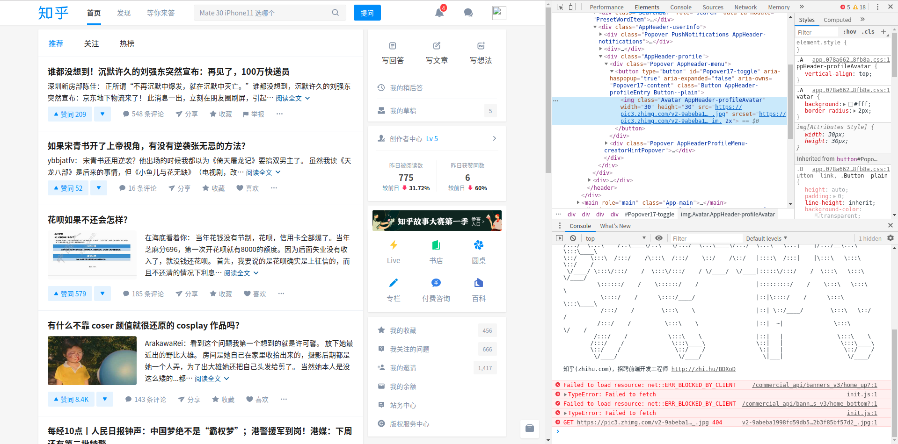
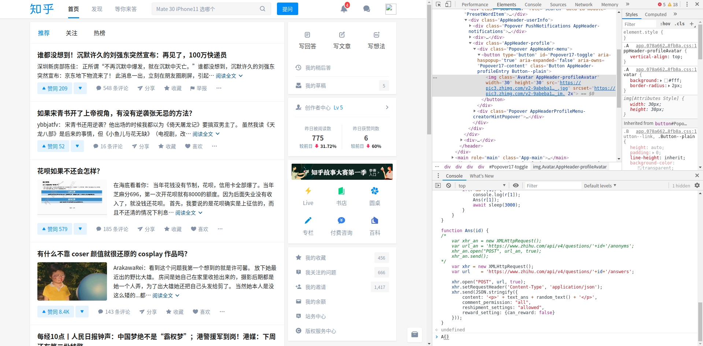
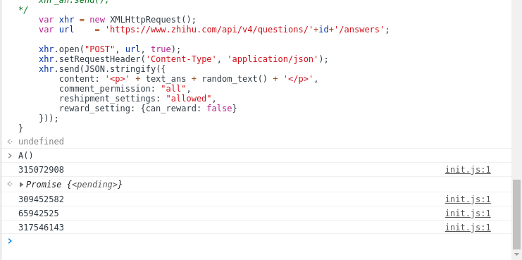

# zhihu-huawei251
自动发布知乎试图打压的内容

（注意：经过对比测试，基本确认本项目地址已经成为了知乎的敏感词）

## 制作原因
华为员工离职后被诬告羁押251天，事件发酵后在知乎先是被降热度——明明关注量是热榜第一的十多倍，却只能排到十多名——最后直接被删问题了。我也理解知乎说自己收到了律师函。可是第一，相关内容真的侵犯华为的**合法**权益了吗？真的违反法律法规了吗？第二，即使真的华为法务部门太厉害知乎没办法，用户自发以知乎删不过来的速度发布内容，总不是知乎的错了吧，总不会被华为告了吧(是吗?)。

因此，我决定发起这场行为艺术，用技术和人民的汪洋大海对抗资本对言论、信息自由的压制，维护法律尊严

## 特点
使用简单，不需要任何编程基础，不需要安装任何编译器/解释器，复制代码到浏览器中即可运行

## 功能列表
+ [自动添加后缀](https://github.com/zhihu-huawei251/zhihu-huawei251/blob/master/add_suff.js) ``U()`` 函数

+ [自动刷回答](https://github.com/zhihu-huawei251/zhihu-huawei251/blob/master/zhihu_huawei251.js) ``A()`` 函数

+ [自动刷评论](https://github.com/zhihu-huawei251/zhihu-huawei251/blob/master/zhihu_huawei251.js) ``C()`` 函数

## 使用方法
以自动刷回答为例：

首先打开知乎。Chrome为例，点击F12打开开发工具，找到console：

将脚本的内容粘贴进去，点回车，即可开始给当前页面下所有回答添加评论。开始前，可以通过知乎首页的下拉加载自行控制想多发还是少发。

默认运行``C()``函数发评论，如果希望使用发回答功能，请自行输入的``A()``（匿名）或``A(false)``（不匿名）再点回车。有极大概率被封号。

开始运行后的效果（图中为A函数）：

## 自定义
A函数文字内容、间隔时间等都可以自定义

## 警告

自动刷回答和刷评论极大概率导致被封号（虽然理论上参与的人越多越安全），如果有小号建议使用小号。给已有回答添加后缀暂时效果不详。

## 改进

欢迎协助改进，包括但不限于文字内容、发送方式、防止被自动识别等。

欢迎提issue或PR

还在试图理解知乎的评论是怎么编码的（格式像base64url但是似乎不是）

